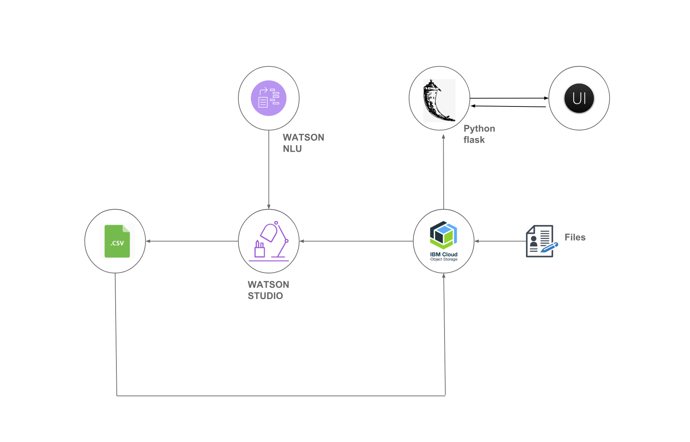

##  Interactive Interface powered by Machine-Automated Natural Language Processing and Machine-Learning using Rest APIs by mining Unstructured Content.

With the advent of AI, Automation of Services has picked up much faster pace than ever before. And hence, technology has also changed  the way customer service solutions are designed. One industry which has gained momentum due to this disruption of Artificial Intelligence is - Customer service industry. Artificial Intelligence has transformed the customer interactions considerably. Machine Learning and Natural Language Processing(NLP) together are the technology behind these interactions. Natural language processing supports your daily interactions with AI software using its ability to process and interpret spoken/written messages.

Let's say we have a mobile phone and some things are working we don't have enough Internet on our phone or the internet provider has sent us a excessively high bill or we want to find out some promotion about roaming overseas because we are about to travel as what we normally do is we call them up and we talk to the customer support Representative. Hence, it was representative who used their mind to assess our problem and come up with a solution and more often than not they can solve our problem. Because it's a human being a human being over the phone there's no natural language processing there. With an immense improvements in the cognitive technology, chatbots are gaining momentum. It's very close to giving the user the experience of texting to another human. It allows you to text things, using it to pass your result into the decision tree and learn.

This composite code pattern brings you the end-to-end solution which will show case on how one can construct interactive interface powered by Machine-Automated Natural Language Processing and Machine-Learning for any decision-support service using rest apis. The composite code pattern makes use of the Code Pattern [`Automating the process of extracting Features for ml model from Unstructured Data`](https://github.com/IBM/extract-features-for-ml-model-from-unstructured-data/blob/master/README.md) and [`Automate the Decision-Making process using Machine learning with Minimal Manual Intervention`](https://github.com/IBM/automate-business-decisions-with-machine-learning).

It's an end-to-end solution as it will :

1. Take the Documents in unstructured formats like PDFs or Word Documents and process them.

2. [Automate the process of Extracting features](https://github.com/IBM/extract-features-for-ml-model-from-unstructured-data) for building the machine learning model for that domain. For more details, go through the [readme.md](https://github.com/IBM/extract-features-for-ml-model-from-unstructured-data/blob/master/README.md).

3.  Prepare Machine learning Model from the data extracted in the step 2 and automate the process of the decision support  using the Code Pattern [`Automate the Decision-Making process using Machine learning with Minimal Manual Intervention`](https://github.com/IBM/automate-business-decisions-with-machine-learning).

4. Interactive Interface will ask you the question then on the basis of your answer, it passes your result into the decision tree and get you the most approriate recommendation. It will analyse further whether to ask next question or the current information received from the user is good enough to take the decision. If yes, which questions to ask. The section `Exposing the Jupyter Notebook Code as Rest API` of the readme.md explains how the python code in the notebook from the Step 3 can be exposed as Rest API  and a python Flask application can be built on top of it. Finally,

5. Deploy the application on IBM Cloud.

# Architecture Diagram.

 

## Steps
Follow these steps to setup and run this code pattern. The steps are
described in detail below.

1. [Automate the process of Extracting features.](#1-automate-the-process-of-extracting-features)
1. [Automate the Decision-Making process using Machine learning.](#2-automate-the-decision-making-process-using-machine-learning)
1. [Exposing the Notebook Code as Rest API.](#3-exposing-the-notebook-code-as-rest-api)
1. [Deploy The Flask Application on IBM Cloud.](#4-deploy-the-flask-application-on-ibm-cloud)

### 1. Automate the process of Extracting features.
Follow the Code Pattern [`Automate the process of Extracting features`](https://github.com/IBM/extract-features-for-ml-model-from-unstructured-data) to understand how to collate various documents of a particular domain and curate the information acquired from them in a structured format. The Code Pattern take the documents regarding the Tuberculosis, curate the information regarding the Tuberculosis and Patients records from various sources like Doctors Transcripts, Lab reports which can aid doctor for follow-ups and also to build a Machine Learning Model of Tuberculosis. However, The Code Pattern can be extended to Documents of any domain. It discusses the strategy to automating the process of generating model for a particular domain by mining Unstructured data.

### 2. Automate the Decision-Making process using Machine learning.
The Above Code Pattern gave a structured CSV format of the Information about the domain `Tuberculosis` which can be understood by the Machine Learning. This Code Pattern showcase how to actually build a machine learning based Decision-Support system without actually defining the dialog, entities etc. using that CSV. To broaden the scope of the Applications of this solution the Code Pattern picks up the Business Travel Request Data for building a Decision-Supoort System. Follow the Code Pattern [`Automate the Decision-Making process using Machine learning.`](#2-automate-the-decision-making-process-using-machine-learning) to understand in detail.

### 3. Exposing the Notebook Code as Rest API.
To stitch the above two code patterns we will have to host the notebook in code pattern [`Automate the Decision-Making process using Machine learning.`](#2-automate-the-decision-making-process-using-machine-learning) as a rest API. To address this, a python flask application is created within this git repo https://github.com/Neha-Setia/Chat-Transcripts/tree/master/questionnaire-path-optimizer

### 4. Deploy The Flask Application on IBM Cloud.
- If you have not deployed IBM Cloud CLI, then deploy it using the [instructions](https://console.bluemix.net/docs/cli/reference/ibmcloud/download_cli.html#install_use)
- Clone git repo by running the command `git clone https://github.com/Neha-Setia/Chat-Transcripts`
- Ensure that you have logged into the org and space of IBM Cloud where you want to deploy python application. You can verify this using the command `ibmcloud target`
- On the command prompt change the directory to the cloned git repo. Within that change directory to `questionnaire-path-optimizer`
- Edit `manifest.yml` file and update `name` to a unique application name. Save the file.
- On command prompt, run the command `ibmcloud cf push` to deploy the application to IBM Cloud
- The python flask application should get deployed successfully and should have started running. So we have rest interfaces for the features in the notebook.

# 5. Deploy client application

# 6. Running the application

# Learn more

* **Data Analytics Code Patterns**: Enjoyed this Code Pattern? Check out our other [Data Analytics Code Patterns](https://developer.ibm.com/code/technologies/data-science/)
* **AI and Data Code Pattern Playlist**: Bookmark our [playlist](https://www.youtube.com/playlist?list=PLzUbsvIyrNfknNewObx5N7uGZ5FKH0Fde) with all of our Code Pattern videos
* **Watson Studio**: Master the art of data science with IBM's [Watson Studio](https://dataplatform.ibm.com/)
* **Decision Tree**: Learn more about the [decision tree in Machine learning](https://towardsdatascience.com/decision-trees-in-machine-learning-641b9c4e8052)
* **More on Decision Tree**: Learn more about the [ classification decision tree in Machine learning](https://medium.com/machine-learning-101/chapter-3-decision-trees-theory-e7398adac567)

# Troubleshooting

[See DEBUGGING.md.](DEBUGGING.md)

# License

[Apache 2.0](LICENSE)
